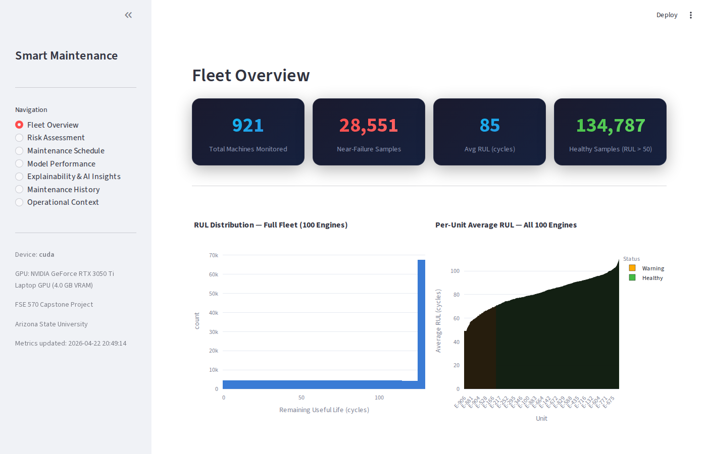
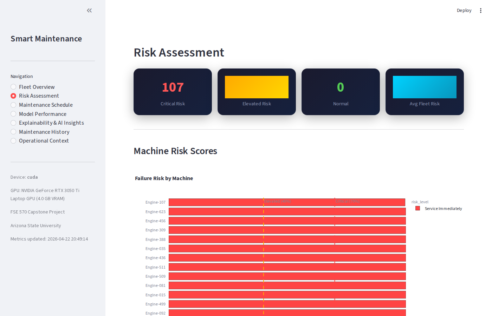
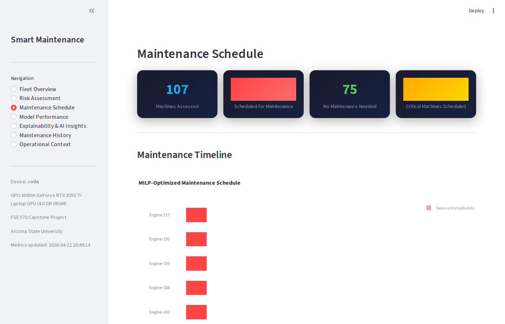
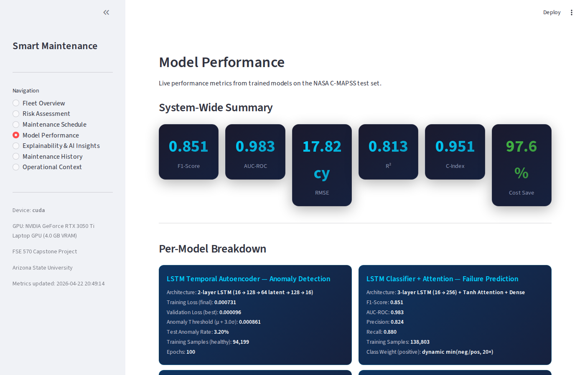
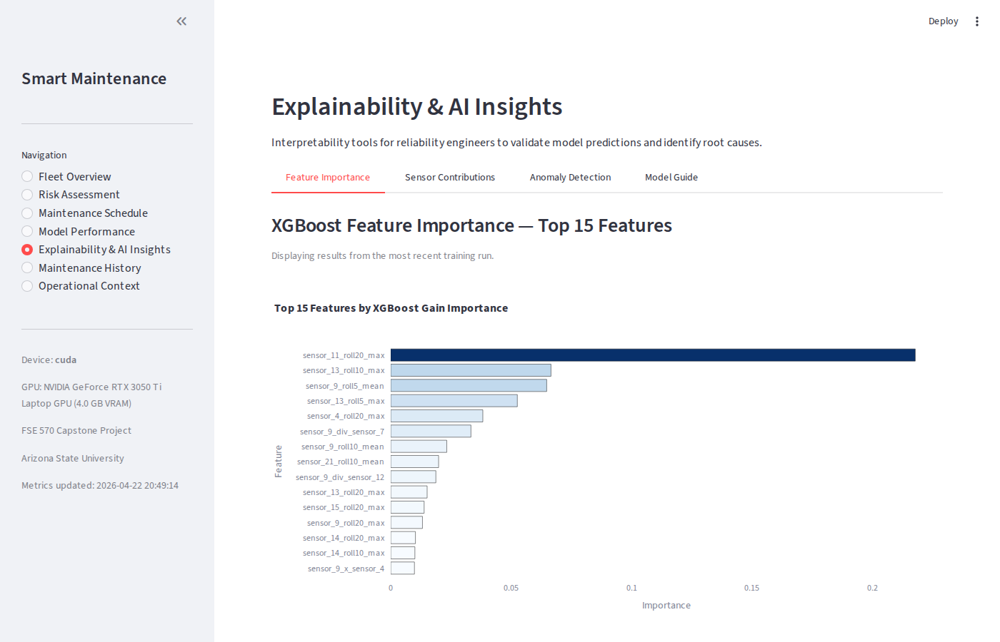
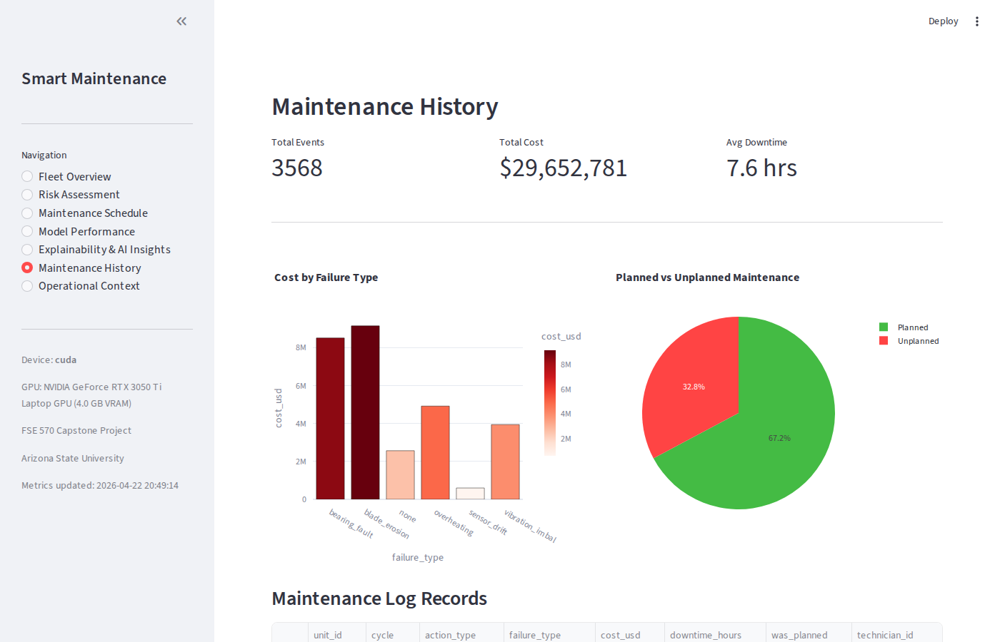
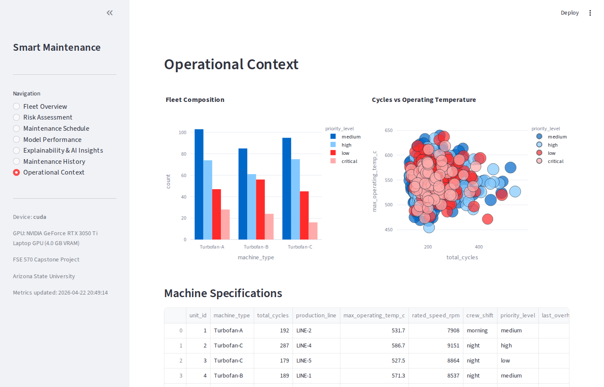

# Smart Industrial Maintenance System

> **FSE 570 Data Science Capstone** — Arizona State University, Ira A. Fulton Schools of Engineering

An end-to-end AI-powered maintenance decision support system that detects anomalies in industrial sensors, predicts machine failures with calibrated uncertainty, estimates Remaining Useful Life (RUL), and generates optimized crew-constrained maintenance schedules. Validated on two NASA datasets: **C-MAPSS turbofan** and **IMS Bearing** vibration data.

---

## Team

| Name | Role |
|------|------|
| Anoushka Jaydas Dighe | Team Member |
| Deva Siva Kanth Tavvala | Team Member |
| Mohit Kumar Petla | Team Member |
| Umang Rajnikant Bid | Team Member |
| Urvansh Jignesh Shah | Team Member |

---

## System Pipeline

```
Raw Sensor Data
     │
     ▼
Preprocessing & Feature Engineering
     │
     ▼
ML Model Suite
 ├── LSTM Temporal Autoencoder     (anomaly detection)
 ├── LSTM Classifier + Attention   (failure probability)
 ├── XGBoost Regression            (RUL estimation)
 └── Bayesian Weibull Survival     (uncertainty quantification)
     │
     ▼
MILP Maintenance Scheduler
     │
     ▼
Monte Carlo Policy Simulation
     │
     ▼
Streamlit Dashboard (7 pages)
```

---

## Performance Results

| Model | Metric | Value |
|-------|--------|-------|
| LSTM Failure Predictor | F1-Score | **0.851** |
| LSTM Failure Predictor | AUC-ROC | **0.983** |
| XGBoost RUL | RMSE | **17.82 cycles** |
| XGBoost RUL | R² | **0.813** |
| Bayesian Survival | C-Index | **0.951** |
| MILP Optimization | Cost Reduction | **97.6%** vs reactive |
| MILP Optimization | Downtime Reduction | **72.5%** vs reactive |
| Monte Carlo Simulation | Failure Reduction | **99.2%** vs reactive |

Latest metrics source: `models/saved/dashboard_metrics.json` (timestamp: 2026-04-22T20:49:14).

---

## Quick Start

### Requirements

- Python 3.9 or higher
- No GPU required — CUDA is auto-detected and used if available

---

### Step 1 — Clone the repository

```bash
git clone https://github.com/SivaKanth007/Smart-Industrial-Maintenance-System.git
cd Smart-Industrial-Maintenance-System
```

---

### Step 2 — Create a virtual environment

Using a virtual environment keeps dependencies isolated and avoids conflicts with your system Python.

**Windows:**
```bash
python -m venv .venv
.venv\Scripts\activate
```

**macOS / Linux:**
```bash
python3 -m venv .venv
source .venv/bin/activate
```

---

### Step 3 — Install dependencies

```bash
pip install -e ".[test]"
```

This installs all required packages including PyTorch, XGBoost, Streamlit, scikit-learn, lifelines, SHAP, PuLP, and pytest.

To enable automatic screenshot capture after each training/inference run (optional):

```bash
pip install playwright
playwright install chromium
```

Once installed, screenshots in `assets/` update themselves every time `run_pipeline.py` or `train_all.py` runs.

---

### Step 4 — Launch the dashboard

Pre-trained models and results are included in the repository. You can launch the dashboard immediately after install — no training required.

```bash
streamlit run dashboard/app.py
```

Opens at **http://localhost:8501**

Seven pages: Fleet Overview · Risk Assessment · Maintenance Schedule · Model Performance · Explainability & AI Insights · Maintenance History · Operational Context

---

### Step 5 — Run tests

```bash
python -m pytest
```

All **50 unit tests** across 4 modules should pass.

---

## Retraining the Models

Pre-trained results are already committed. Retrain only if you want to update the models with new data or changed hyperparameters.

### Path A — Python scripts (C-MAPSS turbofan dataset)

Run these three commands in order:

```bash
# 1. Train all models (downloads NASA C-MAPSS dataset automatically)
python scripts/train_all.py

# 2. Score all engines and generate maintenance recommendations
python scripts/run_pipeline.py

# 3. Launch dashboard to view updated results
streamlit run dashboard/app.py
```

**What each step does:**

| Step | Command | Output |
|------|---------|--------|
| Train | `train_all.py` | Model weights in `models/saved/`, preprocessed sequences in `data/processed/`, synthetic maintenance logs in `data/synthetic/` |
| Inference | `run_pipeline.py` | `data/processed/recommendations.csv` (per-engine risk + schedule) |
| Dashboard | `streamlit run` | Reads all outputs above and displays them |

**Training time:** ~5 minutes on CPU. Significantly faster on GPU.

For GPU support, install CUDA-enabled PyTorch first:
```bash
pip install torch torchvision --index-url https://download.pytorch.org/whl/cu126
```

---

### Path B — Jupyter notebook (IMS Bearing vibration dataset)

The notebooks run the same 4-model pipeline on NASA IMS Bearing data (accelerometer signals from 3 bearing degradation experiments).

```bash
# Install Jupyter if not already available
pip install jupyter

# Open the notebook
jupyter notebook notebooks/Smart_Industrial_Maintenance_Repo_Pipeline.ipynb
```

- `Smart_Industrial_Maintenance_Repo_Pipeline.ipynb` — uses local `src/` imports (requires this repo)

The notebook downloads the NASA IMS Bearing dataset (~2 GB) automatically via `kagglehub`. Kaggle credentials are required — place your `kaggle.json` in `~/.kaggle/`.

Alternatively, train via script:
```bash
python scripts/train_ims.py
```

> **Note:** The notebooks train IMS bearing models and save them to `models/saved/ims_*.pt/.pkl`. They do not overwrite the C-MAPSS models or `recommendations.csv`, so the main dashboard is unaffected.

---

## Make Commands Reference

| Command | Description |
|---------|-------------|
| `make install` | Install project in editable mode |
| `make install-gpu` | Install with CUDA GPU support |
| `make train` | Train C-MAPSS models (downloads data automatically) |
| `make train-ims` | Train IMS bearing models |
| `make inference` | Run inference and generate recommendations |
| `make dashboard` | Launch Streamlit dashboard |
| `make test` | Run all 50 unit tests |
| `make clean` | Remove caches and `__pycache__` directories |
| `make help` | Show all available commands |

---

## Project Structure

```
Smart-Industrial-Maintenance-System/
│
├── config.py                        # All settings: paths, hyperparameters, constants
├── pyproject.toml                   # Python packaging (pip install -e .)
├── Makefile                         # Standardized commands (make train, make test, etc.)
├── requirements.txt                 # Python dependencies
├── pytest.ini                       # Test configuration
├── README.md                        # This file
├── PROJECT_REPORT.md                # Full capstone project report
│
├── scripts/
│   ├── train_all.py                 # End-to-end C-MAPSS training orchestrator
│   ├── train_ims.py                 # IMS bearing model training
│   └── run_pipeline.py             # Full inference pipeline → recommendations.csv
│
├── dashboard/
│   └── app.py                       # Streamlit dashboard (7 pages)
│
├── src/
│   ├── data/
│   │   ├── download.py              # NASA C-MAPSS dataset download
│   │   ├── ims_download.py          # IMS bearing dataset download (kagglehub)
│   │   ├── ims_preprocess.py        # IMS vibration signal preprocessing + feature extraction
│   │   ├── preprocess.py            # C-MAPSS cleaning, normalization, windowing
│   │   ├── feature_engineering.py  # 200+ rolling, trend, lag, interaction features
│   │   ├── synthetic_generator.py  # Maintenance logs + operational context generation
│   │   └── synthetic_cmapss.py     # Synthetic C-MAPSS augmentation
│   │
│   ├── models/
│   │   ├── autoencoder.py           # LSTM Temporal Autoencoder (anomaly detection)
│   │   ├── lstm_predictor.py        # LSTM Classifier with Attention (failure probability)
│   │   ├── xgboost_rul.py           # XGBoost RUL regression
│   │   └── bayesian_survival.py    # Bayesian Weibull Survival Analysis
│   │
│   ├── explainability/
│   │   ├── shap_analysis.py         # SHAP feature attribution (TreeSHAP + DeepSHAP)
│   │   └── attention_viz.py         # Temporal attention heatmap visualization
│   │
│   ├── optimization/
│   │   └── milp_scheduler.py        # PuLP MILP maintenance scheduler
│   │
│   └── evaluation/
│       └── simulation.py            # Monte Carlo maintenance policy comparison
│
├── tests/                           # Unit tests — 50 tests across 4 modules
│   ├── test_preprocess.py           # 15 tests: C-MAPSS preprocessing pipeline
│   ├── test_models.py               # 16 tests: autoencoder, predictor, XGBoost, feature engineering, reproducibility
│   ├── test_optimizer.py            # 8 tests: MILP scheduling, crew constraints
│   └── test_ims.py                  # 11 tests: IMS feature extraction + model compatibility
│
├── notebooks/
│   └── Smart_Industrial_Maintenance_Repo_Pipeline.ipynb       # IMS pipeline (repo-integrated)
│
├── Docs/                            # Project documentation and presentations
│
├── data/                            # Auto-created after training
│   ├── raw/                         # NASA C-MAPSS dataset files
│   ├── raw_ims/                     # NASA IMS Bearing dataset (3 experiments)
│   ├── processed/                   # Preprocessed sequences + recommendations.csv
│   ├── processed_ims/               # IMS preprocessed features
│   └── synthetic/                   # Generated maintenance logs + operational context
│
├── models/saved/                    # Trained model artifacts
│   ├── autoencoder.pt               # C-MAPSS LSTM Autoencoder weights + threshold
│   ├── lstm_predictor.pt            # C-MAPSS LSTM Predictor weights + attention
│   ├── xgboost_rul.pkl              # C-MAPSS XGBoost model + feature importance
│   ├── xgboost_model.pkl            # (alias)
│   ├── bayesian_survival.pkl        # C-MAPSS Weibull AFT model
│   ├── survival_model.pkl           # (alias)
│   ├── preprocessor.pkl             # MinMaxScaler + active feature column config
│   ├── ims_autoencoder.pt           # IMS LSTM Autoencoder
│   ├── ims_predictor.pt             # IMS LSTM Predictor
│   ├── ims_xgboost.pkl              # IMS XGBoost RUL
│   ├── ims_survival.pkl             # IMS Weibull Survival
│   ├── dashboard_metrics.json       # Live dashboard metric source of truth
│   └── simulation_metrics.json      # Monte Carlo policy metrics source of truth
│
└── assets/                          # Dashboard screenshots for documentation
```

---

## Dashboard Preview

Screenshots are auto-generated by `scripts/capture_screenshots.py` after every training/inference run and committed alongside the results.

### Fleet Overview


### Risk Assessment


### Maintenance Schedule


### Model Performance


### Explainability & AI Insights


### Maintenance History


### Operational Context


---

## Dashboard Pages

| Page | Description |
|------|-------------|
| **Fleet Overview** | Aggregate fleet health: machines monitored, near-failure count, avg RUL, RUL distribution histogram, per-unit health bar chart |
| **Risk Assessment** | Per-machine failure risk (Critical / Elevated / Normal), color-coded table, risk distribution pie chart |
| **Maintenance Schedule** | MILP optimizer output as interactive Gantt chart, scheduled slot details table |
| **Model Performance** | Live model metrics cards (F1, AUC, RMSE, R², C-Index), per-model performance breakdown, Monte Carlo simulation results |
| **Explainability & AI Insights** | XGBoost feature importance ranking, SHAP-based sensor contribution analysis, attention pattern description, model interpretation guide |
| **Maintenance History** | Historical maintenance logs: total events, total cost, avg downtime, cost-by-failure-type bar chart, planned vs unplanned ratio |
| **Operational Context** | Fleet composition by machine type and priority, cycles vs temperature scatter, machine specifications table |

---

## Risk Levels

| Level | Condition | Action |
|-------|-----------|--------|
| Critical | Risk >= 70% | Service Immediately |
| Elevated | Risk 40–70% | Schedule Soon |
| Normal | Risk < 40% | Continue Monitoring |

---

## Key Configuration Parameters

All hyperparameters are centralized in `config.py`.

| Parameter | Default | Description |
|-----------|---------|-------------|
| `SEQUENCE_LENGTH` | 30 | LSTM sliding window size (cycles) |
| `MAX_RUL` | 125 | Maximum RUL cap (piecewise-linear model) |
| `TRAIN_RATIO` | 0.70 | Training set proportion |
| `VAL_RATIO` | 0.15 | Validation set proportion |
| `TEST_RATIO` | 0.15 | Test set proportion |
| `AE_EPOCHS` | 100 | Autoencoder training epochs |
| `PRED_EPOCHS` | 50 | LSTM Predictor training epochs |
| `PRED_FAILURE_HORIZON` | 30 | Failure prediction horizon (cycles) |
| `AE_ANOMALY_THRESHOLD_SIGMA` | 3.0 | Anomaly threshold: mean + N * sigma |
| `MAX_CONCURRENT_CREWS` | 3 | MILP crew capacity constraint |
| `DOWNTIME_COST_PER_HOUR` | 10000 | Unplanned downtime cost (USD/hr) |
| `MAINTENANCE_COST_BASE` | 2000 | Base maintenance job cost (USD) |
| `SAFETY_RISK_THRESHOLD` | 0.7 | Mandatory service risk threshold |
| `SCHEDULING_HORIZON` | 10 | Number of scheduling time slots |

---

## Current Run Sanity Notes

- Source of truth for dashboard and report metrics is `models/saved/dashboard_metrics.json` and `models/saved/simulation_metrics.json`.
- Current `recommendations.csv` shows risk saturation (all 107 units are `Service Immediately`, with risk scores in [0.9967, 1.0]).
- Of 107 units, 32 are scheduled and 75 remain unscheduled due to crew/horizon constraints (`MAX_CONCURRENT_CREWS=3`, `SCHEDULING_HORIZON=10`).
- This behavior is useful for stress testing but should be treated as a calibration warning before production deployment.

---

## GPU Support

GPU acceleration is automatic. The system detects CUDA at startup:

```python
# config.py
DEVICE = torch.device("cuda" if torch.cuda.is_available() else "cpu")
```

XGBoost also uses GPU when available (`tree_method=hist`, `device=cuda`). Tested on NVIDIA RTX 3050 Ti Laptop GPU.

To install GPU-enabled PyTorch:
```bash
make install-gpu
# OR
pip install torch torchvision --index-url https://download.pytorch.org/whl/cu126
```

---

## Bring Your Own Data

This system is designed as a reusable baseline. Any time-series sensor dataset that can be reshaped into per-unit cycles can be plugged into the same pipeline — the models, MILP, and dashboard do not assume turbofan-specific physics.

### Expected Input Format

A long-format dataframe with one row per (machine, cycle) and one column per sensor:

| Column | Type | Required | Description |
|--------|------|----------|-------------|
| `unit_id` | int | yes | Machine / unit identifier |
| `cycle` | int | yes | Monotonically increasing time step per unit (1, 2, 3, …) |
| `sensor_1` … `sensor_N` | float | yes | Numeric sensor readings (any number of sensors) |
| `op_setting_1` … `op_setting_3` | float | optional | Operating conditions / regimes |
| `RUL` | float | optional | Remaining useful life. If absent it is computed as `max_cycle_per_unit - cycle` |

### Plug-in Steps (≈ 5 minutes of config work)

1. **Place the data** in `data/raw/` as either:
   - Space-separated `.txt` files (NASA C-MAPSS layout: `unit_id cycle op_setting_1..3 sensor_1..N`), or
   - A custom CSV — point `src/data/download.load_cmapss_train` at it (or write a small loader that returns a long-format dataframe with the columns above).
2. **Update [config.py](config.py)** to match your sensor inventory:
   - `CMAPSS_COLUMNS` — full column list in file order
   - `SENSORS_TO_DROP` — constant / near-constant sensors to discard
   - `OP_SETTINGS_TO_DROP` — operating settings to discard
   - `ACTIVE_SENSORS` — derived list of features actually fed to the models
   - `SEQUENCE_LENGTH`, `MAX_RUL`, `PRED_FAILURE_HORIZON` — adjust to your asset's cycle scale
3. **Tune the cost / capacity knobs** so MILP and Monte Carlo speak your business units:
   - `DOWNTIME_COST_PER_HOUR`, `MAINTENANCE_COST_BASE`
   - `MAX_CONCURRENT_CREWS`, `SCHEDULING_HORIZON`, `SAFETY_RISK_THRESHOLD`
4. **Run the pipeline:**
   ```bash
   make train         # retrains all 4 models on your data + writes dashboard_metrics.json
   make inference     # generates data/processed/recommendations.csv
   make dashboard     # launches Streamlit on http://localhost:8501
   ```
5. **Validate** with `make test` — the suite is dataset-agnostic and exercises the full preprocessing → model → MILP path.

The same flow runs end-to-end through [notebooks/Smart_Industrial_Maintenance_Repo_Pipeline.ipynb](notebooks/Smart_Industrial_Maintenance_Repo_Pipeline.ipynb), which imports from `src/` and `config.py`. Any change to `config.py` is picked up automatically the next time the notebook kernel is restarted, so the same notebook works as the demo / report artifact for any plugged-in dataset.

---

## Troubleshooting

| Problem | Fix |
|---------|-----|
| `ModuleNotFoundError` | Run `pip install -r requirements.txt` again |
| `No data found` error | Run `python scripts/train_all.py` first |
| Dashboard shows nothing | Run `python scripts/run_pipeline.py` to generate recommendations |
| Tests not found | Run `python -m pytest` from the project root directory |
| IMS download fails | Ensure `kagglehub` is installed: `pip install kagglehub` and Kaggle credentials are set |
| CUDA out of memory | Set `device=cpu` in `config.py` or reduce batch size |

---

## Datasets

| Dataset | Source | Size | Description |
|---------|--------|------|-------------|
| NASA C-MAPSS FD001 | NASA Prognostics Center / Kaggle | ~2 MB | Turbofan engine run-to-failure simulation, 100 units, 21 sensors |
| NASA IMS Bearing | NASA IMS Center / Kaggle | ~2 GB | Accelerated bearing degradation, 3 experiments, 4 accelerometers each |

Both datasets are downloaded automatically by the training scripts. No manual download required.

---

## License

Developed for FSE 570 Data Science Capstone at Arizona State University.
